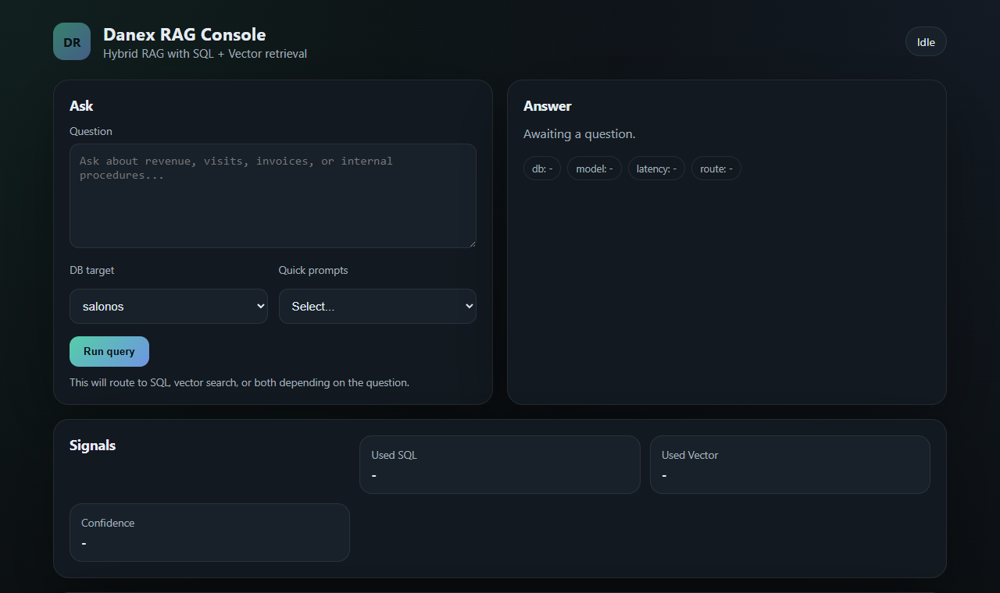

# Danex Global Hybrid RAG Service

> Hybrid FastAPI RAG backend combining semantic retrieval with SQL-backed answers over operational data.



[](https://fastapi.tiangolo.com/)
[](https://langchain.com/)
[](https://deepmind.google/technologies/gemini/)
[](https://github.com/danieloza/danex-rag-service/actions/workflows/ci.yml)

## Product Thesis

Many simple RAG demos stop at:

- uploading a document
- generating embeddings
- returning an answer without a clear signal of where it came from

Danex RAG goes further:

- combines document retrieval with SQL-backed answers
- exposes the selected answer route: `sql`, `vector`, `hybrid`, or `none`
- returns citations with source scores
- stores query history and ingestion history
- provides knowledge-base management from the UI
- includes a lightweight evaluation summary for recent queries

The goal is to show a practical RAG backend, not a one-off LangChain experiment.

## Why This Matters In Production

In real AI systems, the generated answer is not enough.

- operators need to know whether an answer came from operational data or documents
- teams need visibility into which files are currently in the knowledge base
- ingestion should not be a black box
- latency, route choice, and source confidence should be visible
- query history and evaluation summaries help explain how the system behaves over time

## Technical Highlights

- Hybrid pipeline combining FAISS semantic search with Text-to-SQL over operational SQLite data
- FastAPI API layer for inference, ingestion, history, evaluation, and report generation
- Local HuggingFace embeddings with `sentence-transformers/all-MiniLM-L6-v2`
- SQL generation and answer synthesis supported by Gemini
- Pydantic request validation and explicit API contracts
- Health endpoint and basic runtime diagnostics
- Upload + rebuild ingestion workflow
- Query history, ingestion history, and evaluation summary
- Source citations with similarity score and preview

## Tech Stack

- Inference: Google Gemini 2.0 Flash
- Frameworks: FastAPI, LangChain, Pydantic
- Vector store: FAISS
- Data sources: SQLite (`salonos.db`, `danex.db`)
- Embeddings: HuggingFace `all-MiniLM-L6-v2`

## API Surface

- `POST /api/v1/ask`
- `POST /api/v1/query`
- `POST /api/v1/ingest/upload`
- `POST /api/v1/ingest/rebuild`
- `POST /api/v1/report/pdf`
- `GET /api/v1/history/queries`
- `GET /api/v1/ingest/history`
- `GET /api/v1/evals/summary`
- `DELETE /api/v1/ingest/files/{filename}`
- `GET /api/v1/report/download/{filename}`
- `GET /health`

## Demo Walkthrough

1. Upload files into the knowledge base through `Upload + rebuild`.
2. Ask a question from the UI.
3. Check whether the system used the `sql`, `vector`, or `hybrid` route.
4. Expand citations and inspect source preview plus similarity score.
5. Review query history and evaluation summary.
6. Delete a knowledge-base file and rebuild the index to see how the product state changes.

## Installation

Clone the repository:

```bash
git clone https://github.com/danieloza/danex-rag-service.git
cd danex-rag-service
```

Install dependencies:

```bash
python -m venv .venv
source .venv/bin/activate
pip install -r requirements.txt
```

Windows PowerShell:

```powershell
python -m venv .venv
.\.venv\Scripts\Activate.ps1
pip install -r requirements.txt
```

Configure the environment:

```bash
cp .env.example .env
```

Set `GOOGLE_API_KEY` before running full RAG queries. Optional SQLite database paths can be overridden with `SALONOS_DB_PATH` and `DANEX_DB_PATH`.

Run locally:

```bash
uvicorn main:app --host 127.0.0.1 --port 8002 --reload
```

Open:

```text
http://127.0.0.1:8002/
```

Run the smoke tests:

```bash
python -m pytest -q tests
```

## Ingestion And FAISS

Build the local FAISS index:

```bash
python ingest.py
```

`ingest.py` uses MarkItDown to convert files into Markdown, including PDF, DOCX, PPTX, XLSX, HTML, CSV, and JSON. If MarkItDown is not installed, non-text files are skipped with a warning.

## UX Endpoints

- `POST /api/v1/ingest/upload` - upload files to `knowledge_base` with optional rebuild
- `POST /api/v1/ingest/rebuild` - rebuild the FAISS index in the background
- `GET /api/v1/ingest/history` - ingestion history and current knowledge files
- `DELETE /api/v1/ingest/files/{filename}` - delete a knowledge file and optionally rebuild
- `GET /api/v1/history/queries` - recent query history
- `GET /api/v1/debug/index` - index status and ingestion metadata
- `GET /api/v1/debug/db` - SQLite database status
- `GET /api/v1/evals/summary` - query count, route breakdown, average latency, and average top score

The `/api/v1/ask` response also includes:

- `meta.route`: `sql`, `vector`, `hybrid`, or `none`
- `citations`: source snippets from vector retrieval
- `citations[].score`: normalized source similarity score

The UI shows:

- query history
- ingestion history
- source preview through expandable citations
- knowledge files with delete + rebuild actions
- evaluation summary for recent queries

## Proof Assets

- console overview: [docs/assets/console-overview.png](docs/assets/console-overview.png)  
  Shows the main screen with question input, answer, selected route, and citations.
- ingestion workflow: [docs/assets/ingestion-workflow.png](docs/assets/ingestion-workflow.png)  
  Shows knowledge files, upload/rebuild, and ingestion history.
- query + eval history: [docs/assets/query-eval-history.png](docs/assets/query-eval-history.png)  
  Shows query history and a lightweight quality-monitoring layer.

Notes:

- `GET /health` and local smoke tests do not require an active Gemini request.
- Full hybrid answers require `GOOGLE_API_KEY` and access to the target SQLite data sources.

## Architecture Notes

- Vector context is loaded from the local `faiss_index` directory.
- SQL answers are generated against SalonOS and Danex SQLite databases.
- PDF reports are generated by `pdf_generator.py`.
- The service prefers a local `.env` and falls back to a shared `.env.global` when present.
- The project is designed as an AI inference layer that can sit next to a business backend stack.

## Interview Framing

Danex RAG is a hybrid FastAPI RAG backend that combines semantic retrieval with SQL-backed answers over operational data. The goal was to build something more practical than a document chatbot: ingestion, route transparency, source scoring, query history, and a simple evaluation summary.

## Additional Documentation

- Architecture: [docs/ARCHITECTURE.md](docs/ARCHITECTURE.md)
- Case study: [docs/CASE_STUDY.md](docs/CASE_STUDY.md)
- Short Polish interview version: [docs/README_SHORT_PL.md](docs/README_SHORT_PL.md)
